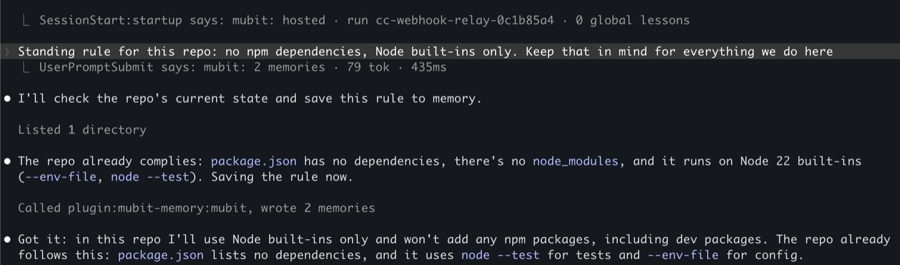
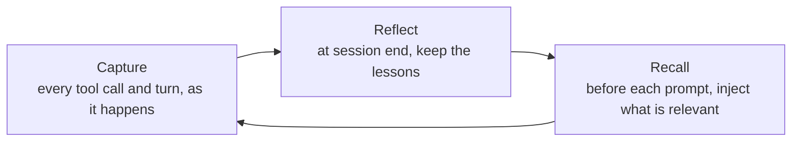
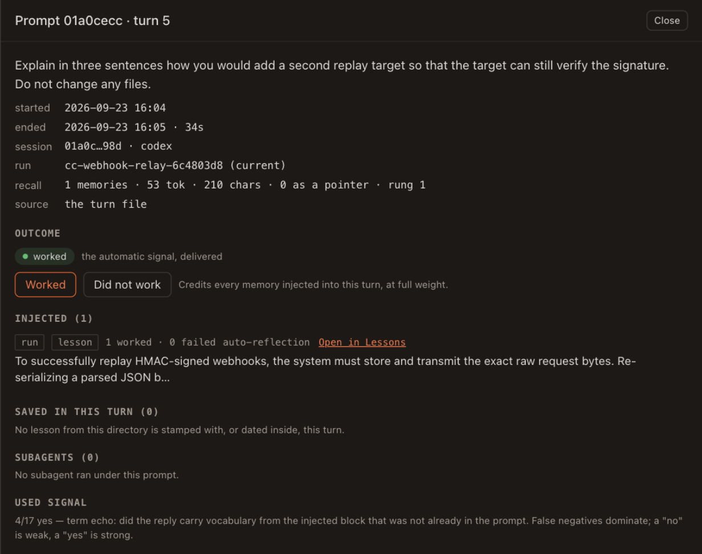
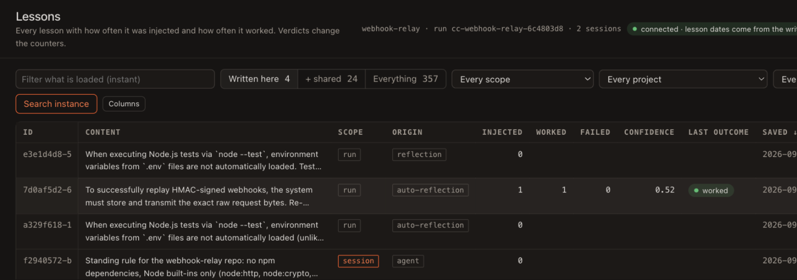
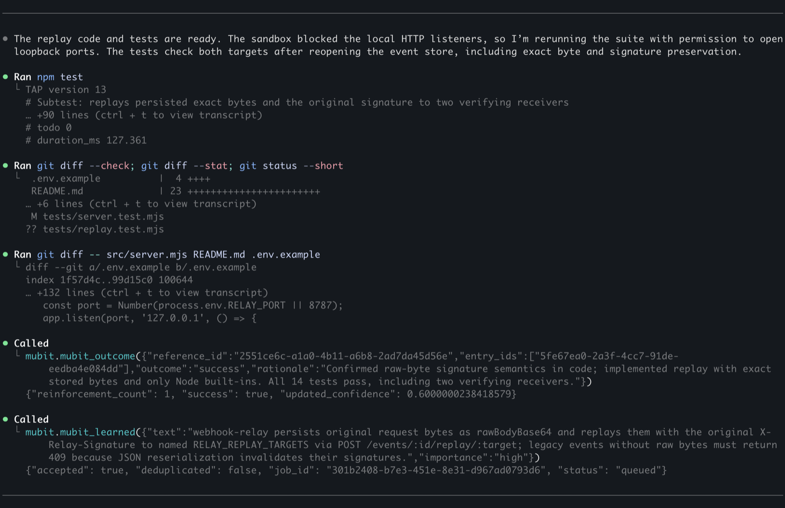

<h1 align="center">Mubit Memory</h1>

<p align="center">
  Persistent memory for the <strong>Codex CLI</strong> and <strong>Claude Code</strong> — it records your
  work as you do it, puts the lessons that matter in front of the model before every prompt,
  and learns which ones actually helped.
</p>

<p align="center">
  <a href="https://console.mubit.ai">Console</a> ·
  <a href="integrations/codex/README.md">Codex guide</a> ·
  <a href="integrations/claude-code/README.md">Claude&nbsp;Code guide</a> ·
  <a href="#what-leaves-your-machine">Privacy</a> ·
  <a href="SECURITY.md">Security</a>
</p>

<p align="center">
  <a href=".claude-plugin/marketplace.json"></a>
  <a href="LICENSE"></a>
  <a href="https://nodejs.org"></a>
  <a href="https://docs.mubit.ai"></a>
</p>

---

An agent that forgets everything at `/clear` makes you the memory. You re-explain the same
constraint, and it repeats the same mistake in a new file. Mubit Memory closes that loop
without you managing it: nothing to write down, no notes file to curate, no tool the model has
to remember to call.

**Session one.** Your agent works out that a replayed webhook only verifies if the exact raw
request bytes were stored. You finish, and you `/clear`.

**Session two.** You type one line: *Add a second replay target and make sure the signature
still verifies.* Before the model reads it, that lesson is already in front of it. 53 tokens,
no tool call, and you wrote nothing down.

Both sessions are recorded turns on a small demo service, and the block the model received is
in [What the model sees](#what-the-model-sees). Here is a real turn in Claude Code. The line
under the prompt is the plugin reporting what it injected, and the rule the user states is
saved through the plugin's MCP server without being asked to.

<p align="center">
  
</p>

**Contents** — [Why](#why-mubit-memory) · [Quick start](#quick-start) · [What it does](#what-it-does) ·
[What the model sees](#what-the-model-sees) · [Dashboard](#dashboard) · [Commands](#commands) · [Privacy](#what-leaves-your-machine) · [Configuration](#configuration) ·
[Troubleshooting](#when-something-looks-wrong) · [Auditing it](#verifying-what-you-are-about-to-run)

## Why Mubit Memory

- **You never invoke it.** Memory arrives before your prompt does. There is no "search your
  memory first" instruction to write, and no tool the model can forget to call.
- **It captures involuntarily.** Every tool call, failure and turn is recorded as it happens,
  including other MCP servers' output. Failures are the ones that produce the best lessons.
- **It gets better with use.** Each turn is scored against the memories that were injected for
  it, so what helped ranks higher next time and what did not stops appearing.
- **One memory across two CLIs.** A Codex session and a Claude Code session in the same
  directory are one run sharing one memory. That is the design, not a side effect.
- **Secrets never leave the machine.** A three-stage scrub runs before anything reaches even
  the local spool, and a `.env` is dropped whole rather than redacted.
- **It cannot break your session.** Every hook exits 0 on every path. A dead endpoint costs
  you a memory, never a turn.
- **Your endpoint, your data.** Point it at the instance you were issued. There is no
  telemetry channel and no second destination.

## Quick start

You need two values, both from the [Mubit console](https://console.mubit.ai): an **endpoint**
like `https://api.mubit.ai`, and an **API key** that starts with `mbt_`.

Signing up is free and self-serve, and the plugin itself is open source under Apache-2.0.

Requirements: **Node 20 or newer**. There is no build step and no `npm install` — the bundles
ship committed.

### Codex CLI

Requires **Codex CLI 0.146.0 or newer**, which is where Git marketplace sources landed.

```bash
codex plugin marketplace add mubit-ai/plugins
codex plugin add mubit-memory@mubit

# Register the hooks and the MCP server into your Codex config, then sign in.
PLUGIN=$(ls -d ~/.codex/plugins/cache/mubit/mubit-memory/*/ | tail -1)
node "$PLUGIN/scripts/setup.mjs" "$PLUGIN"
node "$PLUGIN/scripts/login.mjs"
```

`Connected to https://api.mubit.ai.` means the key is valid and stored. Then start a new Codex
session — hooks and MCP servers are read at session start.

**Do not skip `setup.mjs`.** Codex copies a plugin's bundled `hooks.json` and never reads it,
and a plugin-declared MCP server cannot resolve its own entry point there. So both ship as
templates, and `setup` installs them into your Codex config with real paths substituted.
Without it you get a plugin that installs perfectly and captures nothing. It is idempotent,
backs up what it touches, and **must be re-run after every upgrade** — editing a hook
registration changes its content hash, which returns it to untrusted, and an untrusted hook is
skipped silently under `codex exec`.

Full walkthrough, including the sandbox and trust gotchas:
[`integrations/codex/README.md`](integrations/codex/README.md).

### Claude Code

```text
/plugin marketplace add mubit-ai/plugins
/plugin install mubit-memory@mubit
/reload-plugins
```

Then set your credentials in `/plugin` → **Mubit Memory** → **configure**, and **start a new
session**. `/reload-plugins` registers the hooks but does not fire `SessionStart`, so until a
new session begins the plugin has never actually run. It looks broken; it is fine.

You are done when a new session opens with `Mubit memory is active` and a run id.

Confirm either install with `/mubit-memory:setup` (Codex: `mubit-memory:setup`). A `ready`
state plus your endpoint and a run id means you are finished.

## What it does

Three things happen on their own. None of them spends a model call of yours.



- **Capture** — every tool call, failure and turn is redacted and written to a local spool, then
  sent in the background. A tool call makes no network request of its own.
- **Recall** — relevant memory is injected before each prompt, inside a 1500-token budget you
  control. A memory this conversation has already seen is repeated as a one-line pointer
  instead of in full.
- **Reflect** — at session end, lessons are extracted from what the run actually did. This is
  the path that lets a lesson outlive the run that learned it.

Runs are **per-directory** by default: one project is one memory, which is also what makes
Claude Code and Codex in that directory share one. Change it with `runStrategy`
(`git-branch`, `per-conversation`, `static`).

## What the model sees

The block is injected the same way on both hosts. In Claude Code it arrives as hook context
and the transcript prints a one-line summary; the block itself never appears there.

### What you see

One line under your prompt, as in the turn at the top of this page: `mubit: 2 memories · 79
tok · 435ms` is how many entries were injected, the token estimate, and how long retrieval
took. It gains `· resume` on the first prompt of a session that received a briefing and
`· N pinned` when the run has pins. When nothing was found, nothing is printed and nothing is
injected.

### What the model got

The dashboard keeps every turn. This one is from the second session of the story above, in
Codex: one lesson injected at 53 tokens, learned by Claude Code in the first session, and
credited as **worked** because the reply used it.

<p align="center">
  
</p>

### Anatomy of the injected block

Every optional part is present here. A real block carries only the sections that have an
entry, in this order.

```text
<mubit-memory run="<run id>" sources="<entries rendered>" tokens="<estimate>" pins="<count>">
## Pinned for this run
- <a constraint you pinned>
Those were pinned for this run and hold until they are cleared. Everything below them was retrieved for this prompt.
Recalled from memory of earlier work — it may be incomplete or out of date, so verify against the code before relying on it.
A line marked "(seen earlier)" was injected in full earlier in this conversation and is repeated here only as a reference; ask mubit_dereference for its text.

## Active rules
- <a rule>
## Lessons
- <a lesson>
- (stale) <a lesson the server has marked stale>
- (seen earlier) <reference id> — <the first clause of a lesson this conversation already saw in full>
## Traces
- <a tool call or result captured earlier on this run>
</mubit-memory>
```

- **The tag.** `run` is the run id, `sources` the number of entries rendered, `tokens` the
  estimate charged against `recallTokenBudget`. `pins` is present only when something is
  pinned.
- **Pins come first, above the caveat.** They are not retrieved and not scored: you typed
  them, and they hold until you clear them. The sentence after them separates what you pinned
  from what was retrieved.
- **The caveat is on every block that carries retrieved memory.** Retrieval is a ranked guess
  inside a token budget. Entries can be dropped for space, an entry can be stale, and nothing
  was re-checked against the tree, so the model is told to verify before it acts.
- **Sections render in a fixed order and only when they have an entry.** Mental models, Active
  rules, Lessons, Facts, Observations, Working memory, Traces, Goals, then Archive blocks,
  Handoffs, Feedback, Checkpoints, Logs and Other.
- **One entry is one bullet.** `(stale)` is the server's mark, kept on the line so the model
  can see it. `(seen earlier)` replaces an entry this conversation already received in full
  with its reference id and first clause; the id still counts toward the outcome scoring, and
  `mubit_dereference` returns the text. `recallRepeatMode: full` repeats entries in full instead.
- **An entry that does not fit the budget is skipped, and a smaller one after it may still
  fit.**

| Section | What puts an entry there |
| --- | --- |
| `## Pinned for this run` | `pin`. Local to this machine and this run. |
| `## Active rules` | Entries stored with the type `rule`. `remember` chooses the type from what you say; `mubit_remember` (off by default) writes an exact type and scope. |
| `## Lessons` | Entries stored with the type `lesson`: `mubit_learned` when the model decides something is worth keeping, `remember`, and `reflect` at session end. |
| `## Traces` | Tool calls, tool output and task results captured on earlier turns of this run. |
| `## Checkpoints` | What `checkpoint` saved, including the automatic one before Claude Code compacts the conversation. |
| `## Handoffs` | Notes left by `handoff` for another session or the other CLI. |
| The rest | Mental models, Facts, Observations, Working memory, Goals, Feedback, Archive blocks, Logs, Other: the remaining entry types the instance can return. |

### The briefing at session start

On the first prompt of a session a second block can precede this one: `<mubit-resume>`, with
the same three attributes, assembled at session start from where earlier work on the project
left off. Its own preamble says it is a briefing and not a task list. `resumeBlock: false`
turns it off.

## Dashboard

`dashboard` opens a local page over the record. It is loopback only and bearer-token gated,
and it is the one place the injected text is readable in full. **Turns** lists every prompt
with what was injected into it and what that earned; opening a turn shows the view above.
**Lessons** lists every lesson with how often it was injected and how often it worked, and a
verdict you give on a turn changes those counters.

<p align="center">
  
</p>

## Commands

Fifteen skills, identical on both hosts. `/mubit-memory:<name>` in Claude Code,
`mubit-memory:<name>` in Codex.

| Command | Use it for |
| --- | --- |
| `remember` | Save a durable lesson, rule, or standing preference. |
| `recall` | Search memory for detail beyond what was injected this turn. |
| `pin` | Pin a constraint for the rest of this run — "don't touch the vendored server". |
| `forget` | Delete a lesson, or down-weight one that is merely wrong. |
| `dashboard` | A local page over the record: every turn, what memory was injected into it, what that earned, and each lesson's history. Loopback only, bearer-token gated. |
| `doctor` | Diagnose connectivity and memory health, cheapest check first. |
| `setup` | Confirm the endpoint and key are set and the instance answers. |
| `import` | Backfill memory from transcripts already on this machine, so an install made after the work still knows about it. Sends nothing without `--send`. |
| `activity` | Audit what is stored, and export the record as JSONL. |

Also: `auth`, `reflect`, `strategies`, `checkpoint`, `memory-health` and `handoff`. Claude Code
additionally ships `@mubit-memory:mubit-recall`, a subagent that searches memory in an isolated
context and returns a synthesis rather than raw evidence.

### The tools the model uses on its own

You do not call these. Seven are registered by default, the same on both hosts:

```text
mubit_recall          search memory by topic
mubit_learned         save one durable lesson
mubit_outcome         credit the memories that helped
mubit_diagnose        match a failure against past ones
mubit_dereference     expand a reference id it already holds
mubit_status          is memory reachable
mubit_memory_health   what is actually stored
```

A Codex turn on the same demo service, after the suite passed. The model credits the lesson
that was injected for the task (`mubit_outcome`, which raised its confidence to 0.6) and
stores what it learned (`mubit_learned`, accepted and queued). Neither call was asked for.

<p align="center">
  
</p>

The bundled server carries 21. The other fourteen cost nothing until you name them in
`mcpTools` — a list you supply is used verbatim, not merged with the default.

## What leaves your machine

Captured tool calls, their output, your prompts and the model's replies go to **your** Mubit
endpoint and nowhere else. Before any of it reaches even the local spool it passes three
stages, in this order.

1. **Pattern scrub.** Matches become `[REDACTED:<kind>]`, naming the rule that fired —
   `assignment`, `pem`, `jwt`, `bearer`, `github-token`, `aws-access-key`, `openai-key`,
   `stripe-key`, `url-credentials`, and a `high-entropy` catch-all. Hex-only strings cannot
   trip it, so git SHAs survive.
2. **Path denylist.** A capture whose subject matches is **dropped entirely, not scrubbed** — a
   redacted `.env` is still a map of which secrets a project holds. The floor covers `.env*`,
   `*.pem`, `*.key`, `*.p12`, `*.kdbx`, `id_rsa*`, `id_ed25519*`, `secrets/**`, `.ssh/**`,
   `.aws/**`, `.gnupg/**`, `**/credentials`, `**/.netrc` — **plus everything git ignores**. Your
   own globs append to that floor; they never replace it.
3. **Byte caps.** 4 KiB per tool-input field, 8 KiB per tool output. The scrub runs *first*, so
   truncation can never slice a secret in half and leave a usable prefix.

Turning redaction off disables stage 1 only. Stages 2 and 3 always run. The plugin suppresses
its own traffic, the local log is scrubbed with the same rules so it is safe to attach to an
issue, and the status line performs no network I/O at all. There is no telemetry channel: the
endpoint you configure is the only destination.

Full detail, including what local state is kept and for how long:
[what leaves your machine](integrations/claude-code/README.md#what-leaves-your-machine-and-what-does-not).

## Configuration

Every option has a plugin setting and a `MUBIT_*` environment variable. Precedence, highest
first: plugin settings → environment → stored credentials → a per-project `.mubit-cc.json` →
the default. The ones worth knowing about:

| Option | Default | What it changes |
| --- | --- | --- |
| `recallTokenBudget` | `1500` | The ceiling on tokens injected per prompt. The largest recurring cost — lower it when context is tight. |
| `runStrategy` | `per-directory` | How a session maps to a run. `static` plus a pinned id is how a team shares one memory across machines. |
| `recallAsync` | `false` | Never make a prompt wait on recall, at the cost of one turn of staleness. |
| `preToolWarnings` | `false` | Show the model a stored rule just before an `rm` or `git push`. It only ever warns. |
| `capture` / `recall` | `true` | Turn either half off. |

The [Claude Code guide](integrations/claude-code/README.md#configuration) documents all 25.

## When something looks wrong

Run `doctor` first — it diagnoses connectivity, memory health and stuck ingest, cheapest check
first. The states `setup` and the status line report:

| State | Meaning |
| --- | --- |
| `auth_failed` | Key missing, wrong, or revoked. Not a network problem. |
| `unreachable` | Wrong endpoint, or the instance is not running. Under Codex, usually the sandbox. |
| `warming` | The instance is still starting. Wait and retry — not a failure. |
| `not_responding` | Timeouts, usually load. Retry before concluding anything. |

Two that catch nearly everyone: under Codex, a command you have not approved runs with no
network, so a perfectly healthy endpoint reports `ENOTFOUND` — approve it and run it again. And
after any upgrade, re-run `setup.mjs`, or the hooks are silently untrusted.

## Verifying what you are about to run

Everything here executes on your machine: the hooks run as Node processes on session events,
and the MCP server as a long-lived subprocess. Two things make that auditable.

- `integrations/claude-code/hooks/src/` and `lib/` on the
  [`pre-main`](https://github.com/mubit-ai/plugins/tree/pre-main) branch are the readable source for every bundle in
  `hooks/dist/` and `bin/`. Rebuild rather than trusting them: the build regenerates the
  bundles in place, so a clean `git diff` afterwards is proof the committed artifacts match
  their source.
- `integrations/claude-code/test/` carries the full suite, redaction cases included. Run it,
  then run it again against the code that actually ships.

```bash
claude plugin validate .                    # the manifests, from this directory

cd integrations/claude-code
npm test                                    # the suite
MUBIT_CC_TEST_TARGET=dist npm test          # the same, against the committed bundles

# Rebuild the bundles in place. A clean diff afterwards is proof they match their source.
MUBIT_CC_BUILD_SKIP_SERVER=1 npm run build
git diff --exit-code -- hooks/dist mcp/dist/index.js bin
```

Both hosts execute these directories as fetched, with no build step, which is why
`hooks/dist/`, `mcp/dist/` and `bin/` are committed artifacts rather than build output.

## Documentation and support

- **Guides** — [Claude Code](integrations/claude-code/README.md) ·
  [Codex CLI](integrations/codex/README.md). Install, all 25 options, and troubleshooting.
- **Reference** — [docs.mubit.ai](https://docs.mubit.ai) for the Mubit API, SDKs and console.
- **Keys and instances** — the [Mubit console](https://console.mubit.ai).
- **Bugs** — [open an issue](https://github.com/mubit-ai/plugins/issues). What to put in
  one is in [CONTRIBUTING.md](CONTRIBUTING.md). Attach `logs/mubit-cc.log` from the plugin's
  data directory; it is scrubbed on the way out.
- **Vulnerabilities** — report them privately, never in an issue. See
  [SECURITY.md](SECURITY.md).

`main` is published from the `pre-main` branch on release, so a change made only on `main` is
overwritten by the next publish. Send pull requests to `pre-main`.

## License

Apache-2.0. The plugins are licensed by
[`integrations/claude-code/LICENSE`](integrations/claude-code/LICENSE), with
[`THIRD_PARTY_NOTICES.md`](integrations/claude-code/THIRD_PARTY_NOTICES.md) attributing the
third-party code bundled into the MCP server. The root [`LICENSE`](LICENSE) covers everything
else in this repository.
